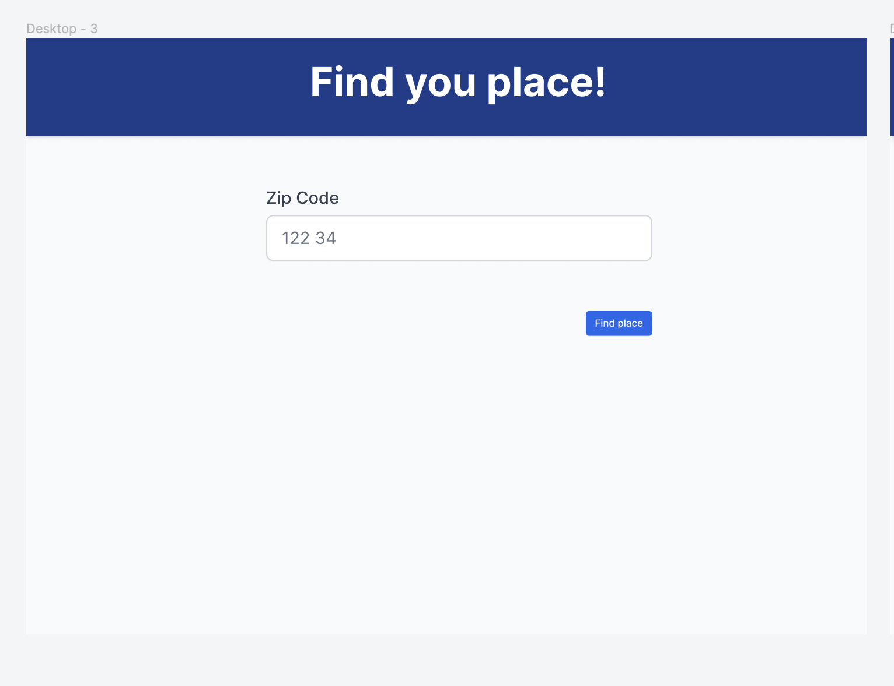
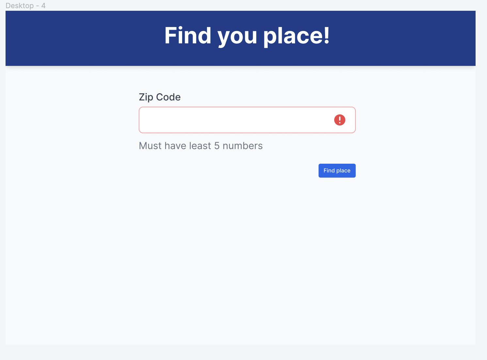
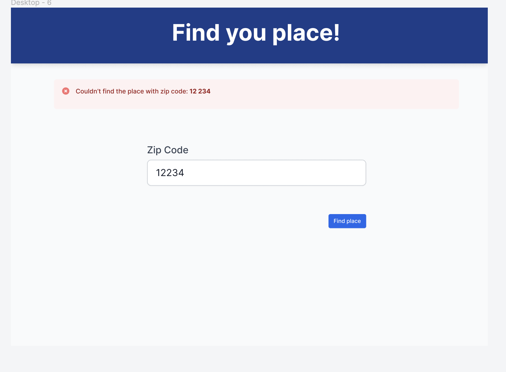
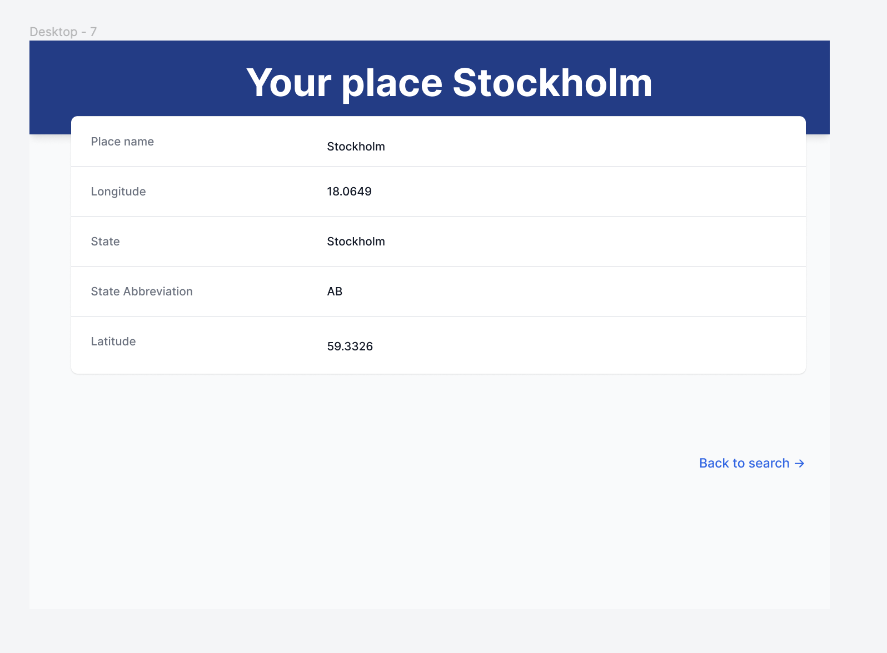

A coding challenge showing a place by zipCode

Technology used in project was,

- React.js
- GraphQL (frontend & backend)
- Storyboard for building components in isolation
- Jest & React-testing library
- TailwindCSS for styling

- Design tool like figma for the initial sketching process

Below is some screenshot over the design












The main piece of technology I use was **RedwoodJS** which provided a nice integration between backend and frontend, testing-utilities, form-builders and decent folder-structure.

In order to run this application

make sure you go to the .env file add these two enviroments

```bash
DATABASE_URL=file:./dev.db

TEST_DATABASE_URL=file:./.redwood/test.db
```

and then run

```bash
  yarn rw prisma migrate dev
```

Now you should be able run the tests and application

for running the test
```bash
  yarn redwood test
```

For starting the development server
```sh
yarn redwood dev
```

For running Storybook
```sh
yarn rw storybook
```
